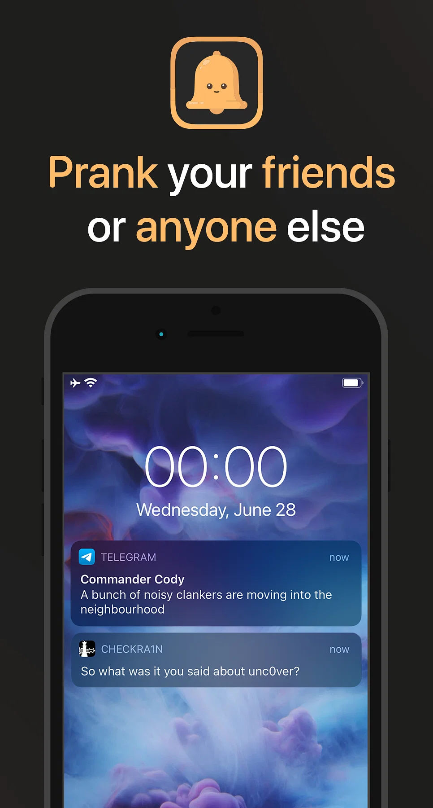

  
  
  

### Dependencies
- [AltList](https://github.com/opa334/AltList?ysclid=ljygq3e9tk103751751)
- [libactivator](https://github.com/rpetrich/libactivator?ysclid=ljygqio0fk3271985)

### Compiling
- [Theos](https://theos.dev/) is required to compile the project.

### Compatibility
iPhone running iOS >= 7.0

### License
[Standart MIT license](https://github.com/MatoiDev/Notifake/blob/main/LICENSE)